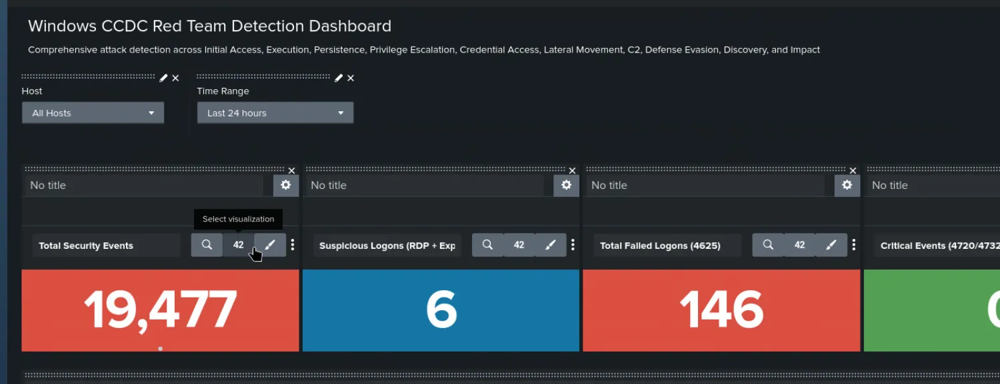
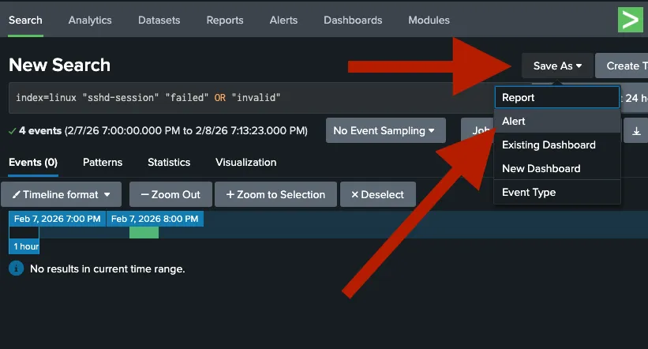
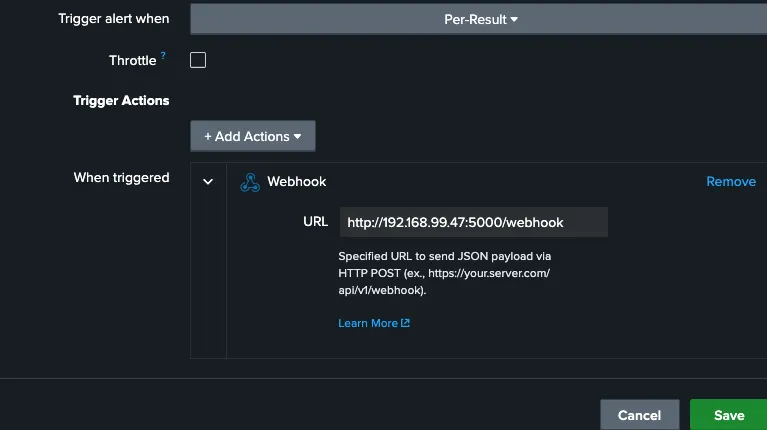
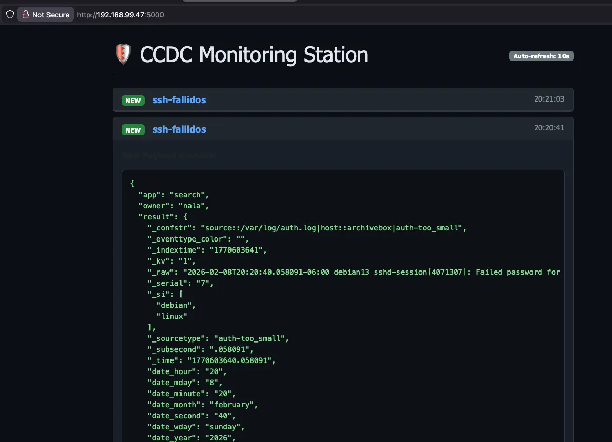
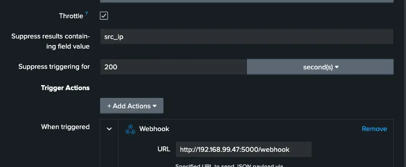
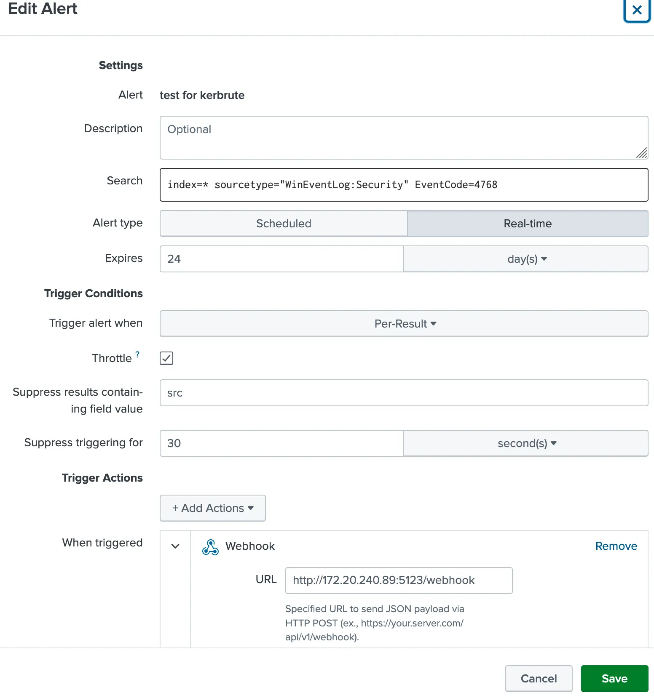
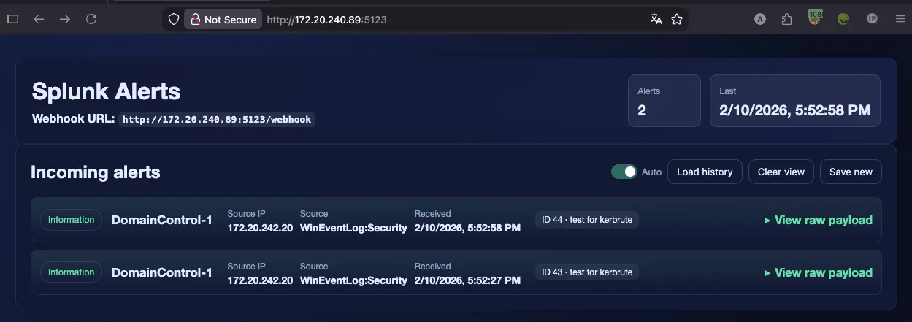
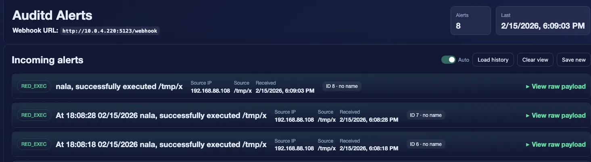

# 🛡️ CCDC Real-Time Alert Dashboard

A lightweight, local SOC dashboard designed for **CCDC (Collegiate Cyber Defense Competition)**. This tool receives Splunk Webhooks and displays security alerts in a clean, filterable web interface, allowing teams to monitor attacks without external internet access.

  

## 🚀 Setup Guide

### Step 1: Create the Splunk Search

Run a search in Splunk to identify the specific activity you want to monitor. For example, to track failed SSH logins:

```splunk
index=linux "sshd-session" "failed" OR "invalid"
```

---

### Step 2: Save as Alert

Once your search is working, save it as an alert to automate the notification process.

1. Click on **Save As** in the top-right corner.
2. Select **Alert**.



---

### Step 3: Configure Webhook Action

In the Alert settings, you must tell Splunk to send the data to your dashboard's IP address.

1. Under **Trigger Actions**, click **Add Action**.
2. Select **Webhook**.
3. Enter your dashboard URL: `http://<YOUR_IP>:5000/webhook`



---

### Step 4: Launch the Dashboard

On your monitoring station, ensure you have **Flask** installed and run the server script.

```bash
# Install dependencies
pip install flask

# Start the listener
python3 website.py
```

Now, open your browser and navigate to `http://localhost:5000` to see your live attack feed.



---

## 🛠️ Requirements

* **Splunk Enterprise** (Local or VM)
* **Python 3.x**
* **Flask**

## 💡 Competition Tip

Remember to enable **Throttling** in the Splunk alert settings to prevent the Red Team from flooding your dashboard with thousands of messages during a brute-force attack!

---

## ⚙️ Configuring Alert Throttling

### Suppress results containing field value

Enter `src_ip`.

**Why?** This tells Splunk: "If I get 500 failures from the same IP address, only send me one alert. But if a different IP address starts attacking, send me a new alert immediately."

### Suppress triggering for

Enter `60` and select **second(s)** (or `300` seconds / 5 minutes).

**Why?** This is your "cool-down" period. Once an alert triggers for a specific IP, Splunk will wait this long before notifying you about that same IP again.



---

## 🔐 Enabling Kerberos Audit Logs (Windows)

To monitor Kerberos authentication activity on Windows systems, you need to enable auditing for Kerberos events. This allows Splunk to capture authentication attempts and ticket operations.

### Enable Kerberos Logging

Run the following commands in **PowerShell** (as Administrator):

```powershell
auditpol /set /subcategory:"Kerberos Authentication Service" /success:enable /failure:enable
auditpol /set /subcategory:"Kerberos Service Ticket Operations" /success:enable /failure:enable
```

**What this does:**
- Enables logging for both successful and failed Kerberos authentication attempts
- Captures Kerberos service ticket operations (TGS requests)
- Logs are written to the Windows Security Event Log

### Verify Configuration

To confirm that Kerberos auditing is enabled, run:

```powershell
auditpol /get /subcategory:"Kerberos Authentication Service"
```

**Expected output:**

```
Kerberos Authentication Service    Success and Failure
```

If you see `Success and Failure`, the audit policy is correctly configured and Kerberos events will now be logged.

---

## 🎯 Example: Detecting Kerberos User Enumeration

Once Kerberos logging is enabled, you can create alerts to detect suspicious authentication activity. One common attack technique is **Kerberos user enumeration**, where attackers attempt to discover valid usernames by requesting Kerberos tickets.

### Create the Alert

Use the following Splunk search to detect Kerberos authentication attempts (Event ID 4768):

```splunk
index=* sourcetype="WinEventLog:Security" EventCode=4768
```

**What this detects:**
- **EventCode 4768** = Kerberos Authentication Ticket (TGT) was requested
- Useful for identifying user enumeration attempts
- Can reveal brute-force attacks or reconnaissance activity

Follow the same steps outlined in the [Setup Guide](#-setup-guide) to save this as an alert and configure the webhook to your dashboard.



**Pro Tip:** Combine this with throttling by `Account_Name` to avoid alert spam during legitimate authentication bursts!

---

## 📊 Viewing Alerts on the Dashboard

Once your alerts are configured and triggering, you should see them appear in real-time on your web server dashboard. The dashboard will display incoming alerts with relevant details, allowing your team to monitor and respond to security events during the competition.




---
---
---


# Audit Server    ***** (auditd_server) ***** 



This section is copied from `audit_server/README.md`.

### Auditd Alerts (Webhook Receiver + Web UI)

This directory contains a small Go server that receives JSON webhooks and shows them in a simple web UI.

It supports two common inputs:

- Collector/auditd sender format (see `alert_sender`): the UI shows a human title like `nala, acting as root, successfully executed /tmp/x`.
- Generic Splunk-style webhook payloads: stored and displayed as-is.

---

### Components

- `main.go`: Go HTTP server with endpoints:
  - `POST /webhook` receives alerts (JSON body, or `payload=<json>` form)
  - `GET /` serves the UI
  - `GET /api/alerts` returns stored alerts as JSON
  - `GET /alerts` returns a text view
  - `POST /api/history/reload` reloads `alerts_history.json`
  - `POST /api/history/rotate` rotates history to a new file and clears memory
- `web/`: static UI served by the Go binary (embedded).
- `alert_sender`: tail-based auditd log watcher that sends RED_EXEC alerts to `/webhook`.
- `alerts_history.json`: local on-disk rolling history.
- `website.py`: old/alternate Flask demo webhook viewer (not used by the Go server).

---

### Quick Start (Go Server)

1. Start the server:

```bash
cd /home/nala/gitHub/Splunk_alerts/audit_server
go run .
```

2. Open the UI:

- `http://<server-ip>:5123/`

3. Send a test webhook:

```bash
curl -sS -X POST "http://<server-ip>:5123/webhook" \
  -H "Content-Type: application/json" \
  -d '{"alert":"RED_EXEC","host":"debian","exe":"/tmp/x","comm":"x","uid":"0","euid":"0","auid":"1000","pid":"123","ppid":"1","tty":"pts0","key":"red_exec","audit":"1771200020.462:7531","text":"demo","raw":"type=SYSCALL msg=audit(1771200020.462:7531): ... success=yes ... AUID=\"nala\""}'
```

#### Port

Default port is `5123`. Override with:

```bash
PORT=8080 go run .
```

---

### Using `alert_sender` (Auditd -> Webhook)

`alert_sender` watches `/var/log/audit/audit.log` for successful `execve` syscalls run as root and sends a JSON alert to the Go server.

#### 1) Set the receiver IP

Edit the `WEBHOOK=` line in `alert_sender` to point to your Go server:

```bash
WEBHOOK="http://10.0.4.220:5123/webhook"
```

Change `10.0.4.220` to the IP of the machine running `go run .`.

#### 2) Adjust what is considered "red"

In `alert_sender`, these arrays control what triggers an alert:

- `ALLOW_PREFIX`: normal/allowed executable paths
- `BAD_PREFIX`: suspicious paths (examples: `/tmp/`, `/dev/shm/`, `/var/tmp/`, etc.)

An alert is sent when:

- the event is `SYSCALL` + `syscall=59` (execve) + `success=yes`, and
- `uid==0` or `euid==0`, and
- the `exe` is in a bad prefix OR not in an allowed prefix

#### 3) Run it

This script needs access to `/var/log/audit/audit.log` (usually root) and requires `python3` for safe JSON encoding.

```bash
sudo bash ./alert_sender
```

---

### Notes / Troubleshooting

- If you see alerts show up as `unparsed`, it means the receiver could not parse the incoming body as JSON. With the current `alert_sender` this should not happen (it uses Python JSON encoding to escape control characters found in audit logs).
- The UI uses the `title` field when present; otherwise it falls back to `host`.
